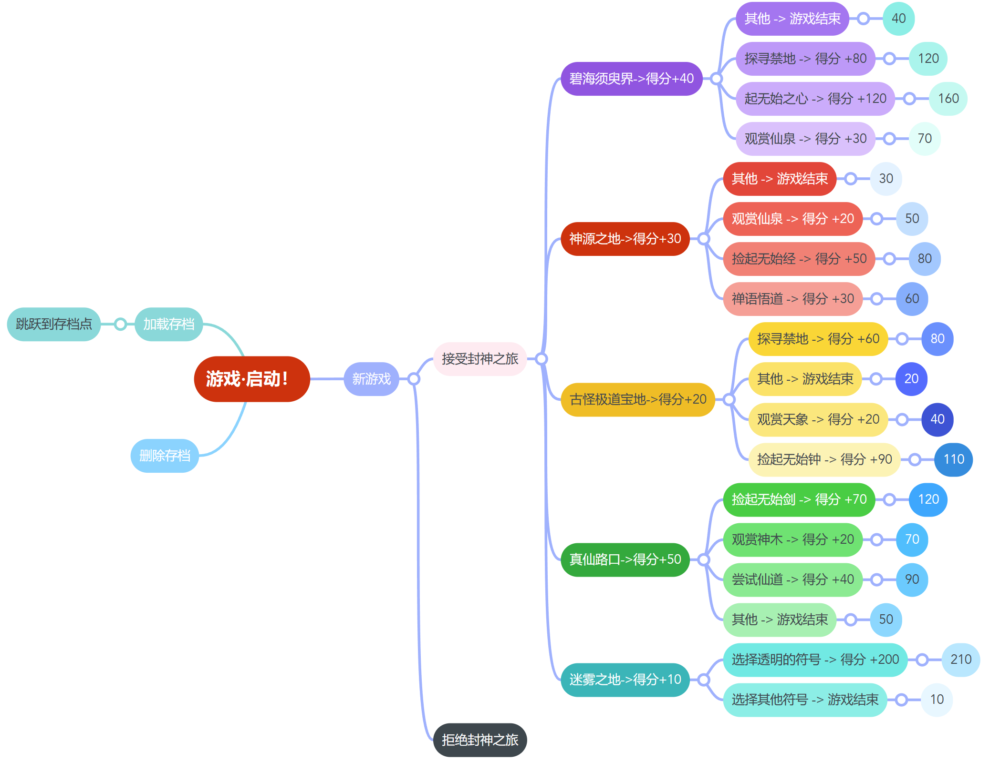

# 大帝封神 (The Immortal Emperor's Seal)

## Introduction
"The Immortal Emperor's Seal" is a text-based RPG set in a world of magic and mystery. Players embark on a quest to find the legendary Immortal Emperor, facing challenges and unraveling secrets along the way.

## Gameplay
Players make narrative choices that propel the story forward, exploring mystical locations, interacting with in-world characters, and solving puzzles. Each decision can lead to different outcomes and affect the game's progression.

## Features
- Explore various mystical environments.
- Decision-making with impactful consequences.
- Scoring system tracking player achievements.
- Account system with secure login and save features.

## Technical Specifications
- **Language:** C
- **IDE:** Visual Studio
- **Platform:** Windows
- Data saved in binary file format.

## Installation
Clone the repository and compile the source code using Visual Studio on a Windows platform.

## Usage
Run the executable after building to start the game. Follow in-game prompts for navigation and choices.

## Contributing
Contributions are welcome. Please fork the repository and submit a pull request with your features or fixes.

## License
This project is licensed under the MIT License - see the LICENSE.md file for details.

## Acknowledgments
Thanks to all the contributors who have invested their time into making this game a reality.

## Contact
- **Developer:** chayunyolong
- **Email:** chayunyolong@gmail.com
- **Project Link:** https://github.com/YoLongChayun/Celestial-Quest-The-Journey-of-the-Immortal-Emperor.git

## Appendix
- [Script](剧本.docx)
- [Endings](结局.png)
- [Test Report](测试报告.docx)

## Release Plan
The game is scheduled for release on GitHub on January 4, 2024. Please check the [release page](https://github.com/YoLongChayun/Celestial-Quest-The-Journey-of-the-Immortal-Emperor.git) for updates and changelogs.
